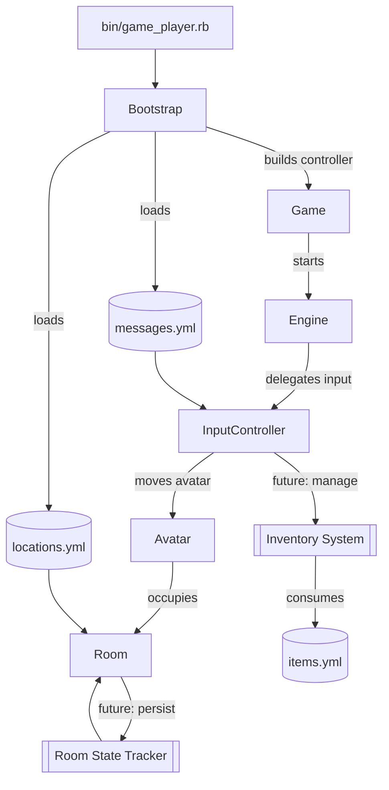
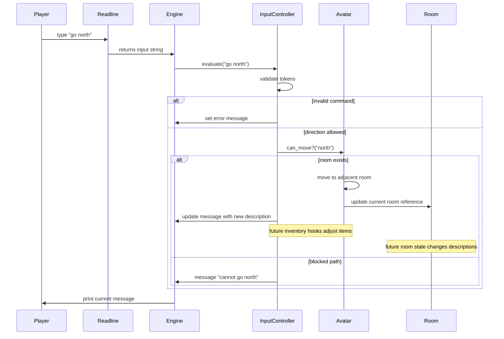

# Architecture Overview

The text adventure is a lightweight Ruby application that wires together a bootstrapper, a simple REPL engine, and data-driven rooms. The entry point `bin/game_player.rb` instantiates `Bootstrap`, which loads YAML data, builds an `InputController`, and hands everything to `Game`. `Game` wraps an `Engine` responsible for printing messages, reading commands through `Readline`, and delegating them to the controller.

## Component Map

The following diagram shows the runtime components and the planned extension points for inventory and room state tracking. The Mermaid source lives at [`docs/diagrams/component_map.mmd`](diagrams/component_map.mmd).

## Command Evaluation Sequence

A `go north` command travels from the player's input to avatar movement through the components below. The Mermaid source is stored at [`docs/diagrams/command_sequence.mmd`](diagrams/command_sequence.mmd).

## Data Loading and Relationships

`Bootstrap` initializes a `GameDataLoader` to parse YAML files. `load_location_data` materializes `Room` instances, and `establish_relationships` replaces directional handles with room objects so the avatar can navigate. Messages such as the splash screen and contextual help come from `messages.yml` and are assigned to the controller. Although `items.yml` defines an item list, no runtime code currently loads it.

Each room YAML entry may include:

- `handle`: unique identifier used for directional links.
- `desc`: base description shown when entering a room.
- `info`: detailed description surfaced via `look`.
- `rooms`: map of direction keywords to neighboring handles.
- Optional `items`: currently unused by the engine.

## Current Limitations and Planned Extensions

- The `InputController` only recognizes `go`, `look`, `help`, `exit`, and `quit`, with minimal validation.
- There is no inventory system: `items.yml` is never loaded, and rooms cannot give or remove items.
- Room descriptions never change after actions, so collecting an item or revisiting a location shows identical text.
- The REPL loop has no natural termination aside from `exit`/`quit`, so debugging requires manual intervention.

Future work should incorporate:

- An inventory subsystem that reads `items.yml`, associates items with rooms, enables pickup/use verbs, and updates the controller's responses.
- A room state tracker that adjusts descriptions or available exits based on interactions.
- Enhanced command parsing to support richer grammar, possibly leveraging the backlog noted in `TODO` (e.g., NPCs, level editor).
